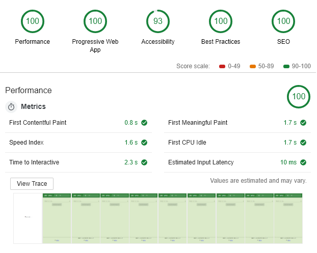

# Simple Exchange Rates

[](https://app.netlify.com/sites/simple-exchange-rates/deploys)

An example of a simple exchange rates web apps built in React Redux based on Create React App.

Live Preview : https://simple-exchange-rates.netlify.com/



### Access Locally

```
$ git clone https://github.com/yasintze/simple-exchange-rates.git
$ cd simple-exchange-rates
$ yarn install
$ yarn run start
```
